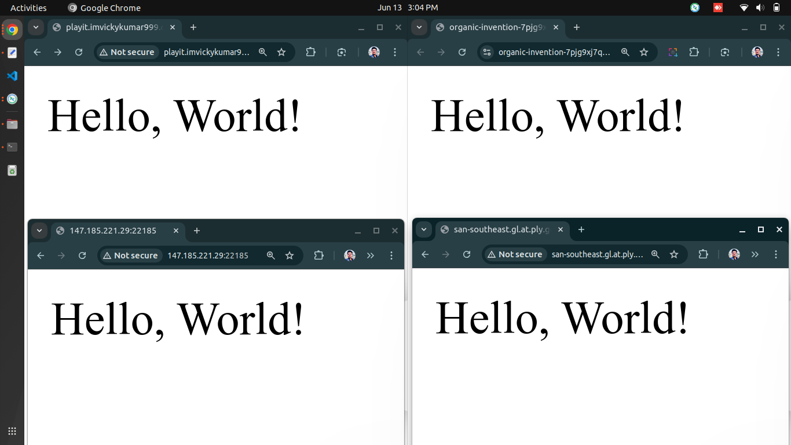

# `Docker Django Deploy`

```bash
# to up docker
docker-compose up -d

# lists running Docker containers
docker ps -a

# to down docker
docker-compose down

# if Error response from daemon
./fix-docker-zombies.sh
```




